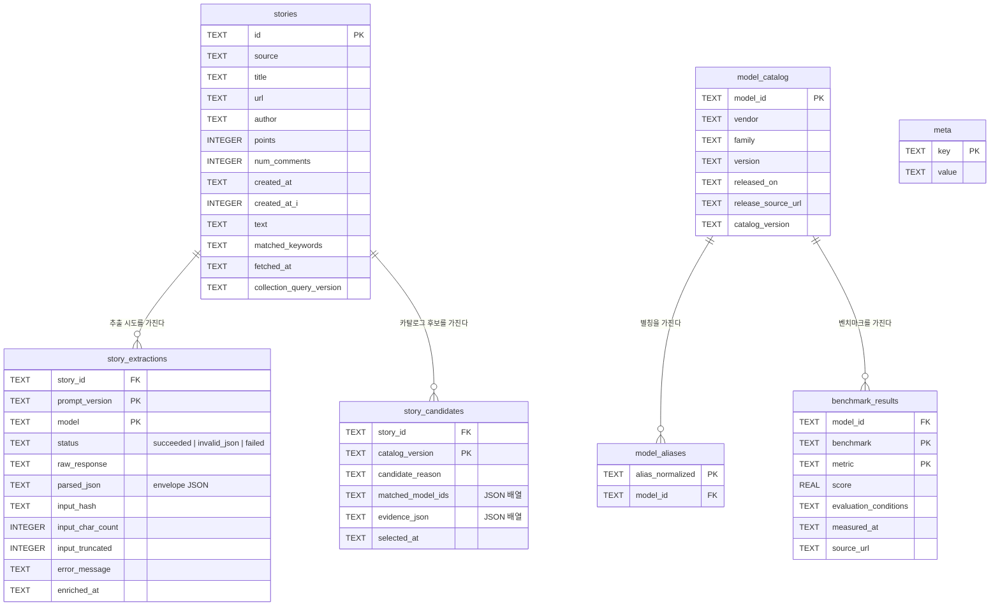

# AI Pulse — 아키텍처 레퍼런스

현재 코드(`db.py`, `reference_data.py`, `enrich.py`, `session_enrich.py`,
`candidate_selection.py`, `analysis.py`) 기준으로 DB 스키마, 모듈 로직,
추출 온톨로지를 정리한 문서다. 설계 근거의 원본은 여전히
`docs/superpowers/specs/2026-07-14-ai-pulse-design.md`이며, 이 문서는 설계
결정 기록이 아니라 "지금 실제로 무엇이 있는가"를 보여주는 실무 지도다.

## 파이프라인 계층

```
Bronze          Reference data         Silver                    Gold
collector.py -> stories        model_catalog/aliases      story_extractions   analysis.py
                                (reference_data.py)   ->   (session_enrich.py, ->  (read-only
                                        |                   enrich.py)              pandas)
                                        v
                              candidate_selection.py -> story_candidates
```

- **Bronze** (`collector.py`): Algolia HN story를 가져와 `stories`에 upsert한다.
- **Reference data** (`reference_data.py`): JSON에서 출처가 있는 버전 관리형
  `model_catalog` + `model_aliases`를 임포트하고, 자유 텍스트 surface를 모델로
  해석하며, 카탈로그를 세션 추출용 컨텍스트 카드로 1회성 렌더링한다.
- **Candidate selection** (`candidate_selection.py`): 현재 카탈로그를 기준으로
  `stories`에 결정적 정규식/별칭 매칭을 수행해 `story_candidates`를 쓴다 —
  LLM/세션 호출과 무관한 저비용 사전 필터다.
- **Silver** (`session_enrich.py` + `enrich.py`): 사람 또는 에이전트 세션이
  `pending` 출력(후보 또는 전체 story 큐 + 컨텍스트 카드 1개)을 읽고 story마다
  JSON envelope를 작성하면, `save`/`save_session_result`가 검증 후
  `story_extractions`에 저장한다. 이 코드베이스는 모델 API를 호출하지 않는다 —
  row의 `model` 값은 API 호출이 아니라 라벨(`session-v1`)이다.
- **Gold** (`analysis.py`): story별 최신 성공 `story_extractions` row를 가져와
  `evidence_verified: true`인 observation만 남기고, `model_aliases`로
  `surface`를 해석해 트렌드/co-occurrence/framing을 집계하는 읽기 전용
  pandas 함수들이다. 쓰기는 전혀 없다.

## ERD (Entity-Relationship Diagram)



컬럼명만 봐서는 알기 어려운 ERD 관련 사항:

- `story_extractions`의 PK는 `(story_id, prompt_version, model)`이다 — 한
  story는 prompt/model 버전이 다른 여러 추출 시도를 누적할 수 있고,
  `latest_successful_extractions()`가 story별 승자 하나를 고른다(가장 최신
  `enriched_at`, 동률이면 `rowid`로 결정).
- `story_candidates`의 PK는 `(story_id, catalog_version)`이다 — 후보는
  카탈로그 버전에 종속되며, 같은 버전으로 재선별하면
  `replace_story_candidates`가 전체를 교체한다. 따라서 `select` 재실행은
  idempotent하다.
- `model_catalog`에는 별도의 버전 이력 테이블이 없다. `catalog_version`은 모든
  row에 붙은 평범한 문자열 컬럼이며, `db.catalog_version()`은 전체 row가 단일
  값으로 일치할 것을 요구한다(아니면 예외) — 이력 테이블이 아니라 "현재 버전"
  플래그 하나다.
- `meta`는 현재 row 1개(collector watermark)만 가진다.

## 모듈 로직 (자명하지 않은 동작만)

**`db.py`**
- `upsert_stories` / `save_extraction` / `import_catalog`는 모두
  `INSERT ... ON CONFLICT DO UPDATE`다 — 모든 쓰기 경로가 설계상 idempotent해서
  재실행이 항상 안전하다.
- `catalog_version(conn)`은 "현재 활성 카탈로그 버전이 무엇인가"의 단일 진실
  소스다. `model_catalog`에 서로 다른 버전이 0개거나 2개 이상이면 `ValueError`를
  낸다. `candidate_selection.py`와 `reference_data.render_context_card` 둘 다
  이 규칙을 직접 재구현하지 않고 재사용한다.
- `_validate_story_candidates`는 저장 전에 모든 후보의 `matched_model_ids`를
  실제 카탈로그와, 모든 `evidence_json` quote를 실제 story의
  `title`/`text`와 교차 검증한다 — 후보가 존재하지 않는 모델이나 존재하지 않는
  인용문을 참조할 수 없다.

**`reference_data.py`**
- `normalize_alias`는 별칭을 조회하거나 매칭하는 모든 곳에서 쓰는 단일
  정규화 함수다: 소문자화 → 비영숫자 연속 구간을 공백 하나로 치환 → trim.
  `resolve_model`(Gold 쪽 조회)과
  `candidate_selection._alias_pattern`(Bronze 쪽 정규식 매칭)이 같은 함수를
  쓰므로 둘이 어긋날 수 없다.
- `render_context_card`는 카탈로그를 (vendor, family, version, model_id)
  순으로 정렬한 결정적 텍스트 블록 하나로 렌더링하고, 마지막에 고정된
  open-world 안내문을 붙인다. 그래서 추출 세션은 스키마를 닫지 않으면서도
  알려진 vendor/family/version/별칭 표기를 미리 알 수 있다 — 목록에 없는
  이름은 카탈로그에 억지로 끼워 맞추지 않고 `unresolved`로 남는다.

**`enrich.py`**
- "고정된 envelope + open-world payload" 계약을 정의한다: *구조*(`relevant`,
  `observations[].surface`, `extensions`)는 `parse_envelope`가 강제하지만,
  그 *안의 값*(`kind`, `role`, `stance`, `framing`)은 자유 텍스트이며 닫힌
  enum으로 검증하지 않는다.
- `verify_evidence`가 주장된 observation을 신뢰 가능한 것으로 바꾸는
  단계다: `evidence.quote`가 참조된 필드(`title`/`text`)의 *안정화되고
  HTML이 제거된* 입력의 정확한 부분 문자열일 때만 `evidence_verified: true`가
  된다. Gold(`analysis.py`)는 이 값이 `true`인 observation만 읽는다.
- `TEXT_CAP_CHARS = 2000`은 해싱 및 안정된 세션 입력이 되기 전에 `text`만
  자르고 `title`은 자르지 않는다 — 잘렸는지는 `input_truncated`로 표시한다.

**`candidate_selection.py`**
- `_alias_pattern`은 별칭마다 단어 경계·공백/구두점을 허용하는 정규식을
  만든다(`[^A-Za-z0-9]+`로 일반화된 `\b매칭\b`). 그래서 "GPT 5"와 "GPT-5"
  둘 다 "gpt 5" 별칭에 걸린다.
- `select_candidates`는 현재 카탈로그 버전의 row 집합을 완전히 교체한다 —
  append가 아니라 재계산이다.

**`session_enrich.py`**
- `pending`은 추출 세션으로 들어가는 유일한 읽기 경로다:
  `{"context_card": str|null, "stories": [...]}`를 내보내며 카드는 배치당
  1회만 나타난다(story마다가 아님). 현재 `(prompt_version, model)` 조합의
  row가 이미 있는 story는 제외되므로, `pending`을 재실행하면 큐가 자연히
  줄어든다.
- `--seed`는 배치 순서를 재현 가능하게 만든다(먼저 `s.id`로 안정 정렬한 뒤
  `random.Random(seed).shuffle`) — 같은 시드로 반복 실행하면
  `created_at_i DESC`로 흔들리지 않고 같은 순서를 이어간다.
- `save`는 검증 실패를 절대 그냥 흘려보내지 않는다: 유효하지 않거나 손상된
  세션 응답도 `status="invalid_json"`과 에러 메시지로 저장된다(버려지지
  않음) — row가 항상 존재하므로 재시도 상황이 눈에 보인다.

**`analysis.py`**
- 모든 공개 함수는 이 모듈 안에서 만든 SQL 뷰 위의 읽기 전용 pandas다 —
  쓰기 없음, notebook/MCP 코드와 결합 없음.
- `_load_verified_observations`는 unresolved surface를 절대 버리지 않는다.
  자기 자신만의 그룹(`resolution_status="unresolved"`, 원문 surface 텍스트로
  그룹핑)으로 남겨서 emerging/co-occurrence/framing 결과가 조용히 과소
  집계되지 않고 완전하게 유지된다.
- "candidate" 계열 Gold 함수(`candidate_emerging_models`,
  `candidate_model_cooccurrence`)는 시간창/정렬 로직을 extraction 기반
  함수와 동일하게 따라가지만, `story_extractions` 대신 `story_candidates`를
  읽는다 — 후보는 감정(sentiment)을 갖지 않고 별칭 매칭만 갖고 있으므로
  `stance`/framing 차원이 없다.
- `_metadata`는 `prompt_version`/`collection_query_version`을 config가 아니라
  실제로 로드된 observation에서 유도한다. 그래서 Gold 결과는 항상 어떤
  파이프라인 버전이 만들었는지 스스로 밝힌다. 반면 `catalog_version`은
  개별 story가 아니라 `model_catalog` 테이블 자체에서 온다.

## 추출 온톨로지 (`enrich.EXTRACTION_CONTRACT`)

모든 `story_extractions.parsed_json` envelope는 다음 형태다.

```json
{
  "relevant": true,
  "observations": [
    {
      "surface": "story에 쓰인 그대로의 표기",
      "evidence": {"field": "title|text", "quote": "정확한 부분 문자열"},
      "attributes": {"kind": "...", "role": "...", "stance": "..."},
      "evidence_verified": true
    }
  ],
  "extensions": {"framing": "..."}
}
```

attribute 값들은 어느 것도 닫힌 enum이 아니다 — anchor는 제안일 뿐 스키마
제약이 아니다. 4개 축과 각 축이 답하는 질문:

| 축 | 질문 | Anchor (전부가 아님) |
|---|---|---|
| `kind` | 이 story와 무관하게, 그 *이름*이 무엇을 가리키는가? | `model`, `product`, `organization`, `category` |
| `role` | *이* story의 주장 안에서 그 entity가 어떤 위치를 갖는가? | `subject`, `comparison_baseline`, `instrument`, `evaluated_item`, `passing_mention` |
| `stance` | *story*가 그 entity를 어떻게 평가하는가(`kind`가 `model`/`product`일 때만 설정)? | `positive`, `negative`, `neutral`, `mixed` |
| `extensions.framing` | 이 story 전체가 어떤 장르인가? | `release_announcement`, `benchmark_claim`, `incident_report`, `comparison`, `ecosystem_tooling`, `research`, `opinion` |

`resolution_status`(Gold가 계산, DB에 저장되지 않음)는 `surface`가
`model_aliases`와 매칭되면 `resolved`, 아니면 `unresolved`다 — unresolved
row도 버려지지 않고 원문 surface 텍스트로 그룹핑되어 보존된다. 파이프라인
전체를 관통하는 open-world 원칙 그대로다.

`story_candidates.candidate_reason`은 현재 항상 `"catalog_alias_match"`다 —
이 필드는 나중에 다른 후보 선정 전략(예: 키워드 전용, story 간 클러스터링)이
스키마 변경 없이 구분될 수 있도록 미리 마련해 둔 것이다.
